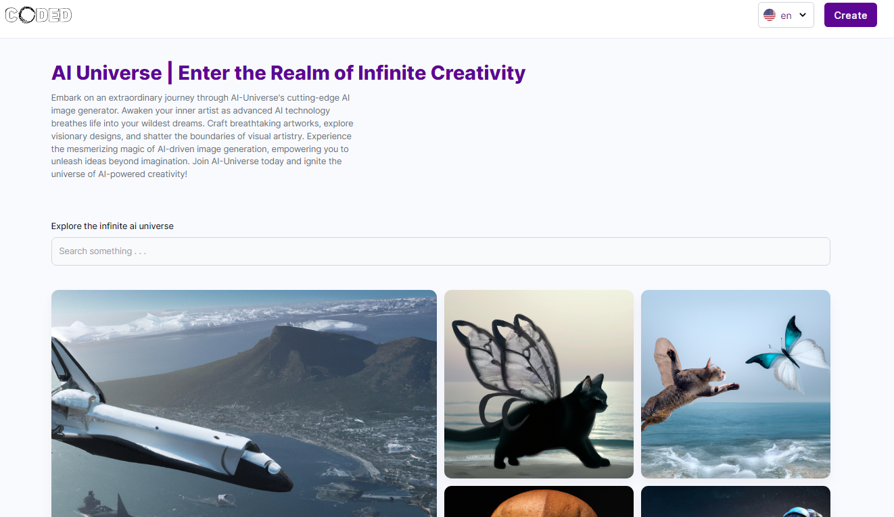

# Pixel Galaxy

Welcome to Pixel Galaxy, a captivating child site within the AI Universe. Immerse yourself in a Dall-E-like experience where users can unleash their creativity, crafting images, sharing them with the community, and reveling in stunning designs. The platform seamlessly supports two languages: Farsi (Fa) and English (En).

## Project Structure

Explore the intricacies of Pixel Galaxy organized into two pivotal folders:

- **Client:** A cutting-edge Vite React app powering the captivating frontend.
- **Server:** A robust Node.js server orchestrating backend functionalities.

## Home Page



## Getting Started

### Client

1. Navigate to the `client` folder:
   ```bash
   cd client
   ```

2. Install dependencies:
   ```bash
   npm install
   ```

3. Start the client:
   ```bash
   npm run dev
   ```

### Server

1. Navigate to the `server` folder:
   ```bash
   cd server
   ```

2. Install dependencies:
   ```bash
   npm install
   ```

3. Start the server:
   ```bash
   npm start
   ```

## Developer Information

For inquiries or reporting issues, connect with the developer via Telegram:

- **Developer:** Coded Pro
- **Telegram ID:** @Coded_Pro
- **Telegram Link:** [t.me/coded_pro](https://t.me/coded_pro)

## Credits

Pixel Galaxy, a stellar creation within the AI Universe, was meticulously developed by Coded Pro. Your journey begins here!
